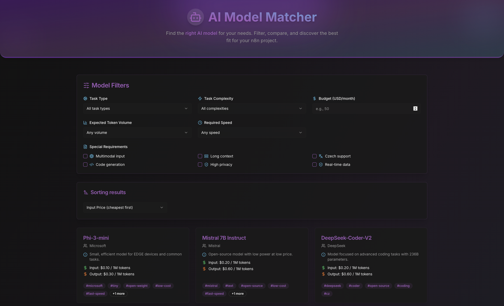

# AI Model Matcher

AI Model Matcher is a web app that helps you discover, filter, and compare AI models for your projects. It features a beautiful UI, advanced filtering, and real-time data powered by [Supabase](https://supabase.com/).

## Features

- 🔍 **Search & Filter:** Find AI models by provider, price, usage, and more.
- 💸 **Budget Estimation:** Estimate monthly costs based on your token volume and budget.
- 🏷️ **Tag & Requirement Filters:** Filter models by special requirements and tags.
- ⚡ **Sorting:** Sort models by input/output price or name.
- 🌈 **Modern UI:** Responsive, animated, and accessible design.
- ☁️ **Supabase Backend:** Models are loaded from a Supabase PostgreSQL database.

## Demo



## Getting Started

### 1. Clone the repository

```sh
git clone https://github.com/yourusername/ai_model_matcher.git
cd ai_model_matcher
```

### 2. Install dependencies

```sh
npm install
```

### 3. Configure environment variables

Create a `.env.local` file in the root directory and add your Supabase credentials:

```
NEXT_PUBLIC_SUPABASE_URL=https://ozwmygczxazhvzxesnbw.supabase.co
NEXT_PUBLIC_SUPABASE_ANON_KEY=your_supabase_anon_key
```

### 4. Run the development server

```sh
npm run dev
```

Open [http://localhost:3000](http://localhost:3000) to view the app.

## Database Setup

Create a `models` table in your Supabase project:

```sql
create table models (
  id uuid primary key default gen_random_uuid(),
  name text not null,
  provider text not null,
  usage text,
  input_price float8 not null,
  output_price float8 not null,
  tags text[] not null
);
```

You can add your models via the Supabase dashboard or SQL.

## Technologies Used

- [Next.js](https://nextjs.org/)
- [React](https://react.dev/)
- [Supabase](https://supabase.com/)
- [Tailwind CSS](https://tailwindcss.com/)
- [Lucide Icons](https://lucide.dev/)

## Author

- [Petr Cafourek](https://petr.cafourek.online)
- [GitHub](https://github.com/)
- [LinkedIn](https://www.linkedin.com/in/petr-cafourek-53875079/)

## License

MIT

## 📖 How to Choose the Right AI Model?

You can find a practical guide for selecting the best AI model for your n8n workflow at:

- Dedicated guide page: **How to choose the right model?** (with markdown content and easy navigation)

This page is accessible from the homepage header and displays content from `public/choose_right_model.md`.
